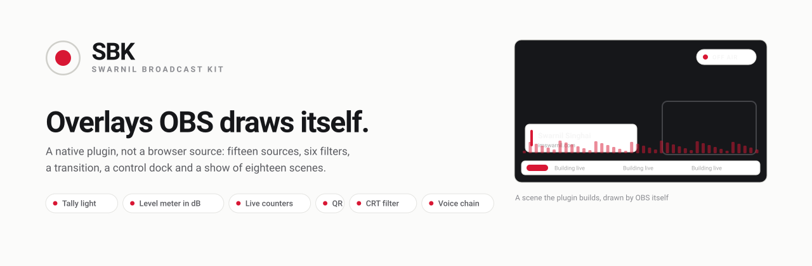
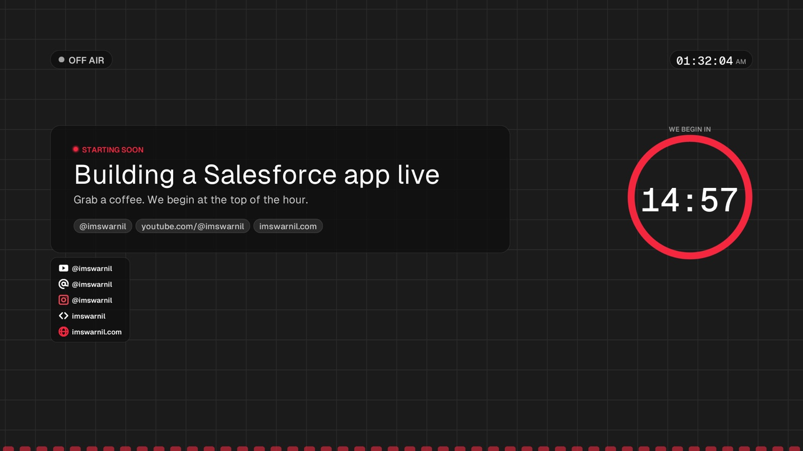
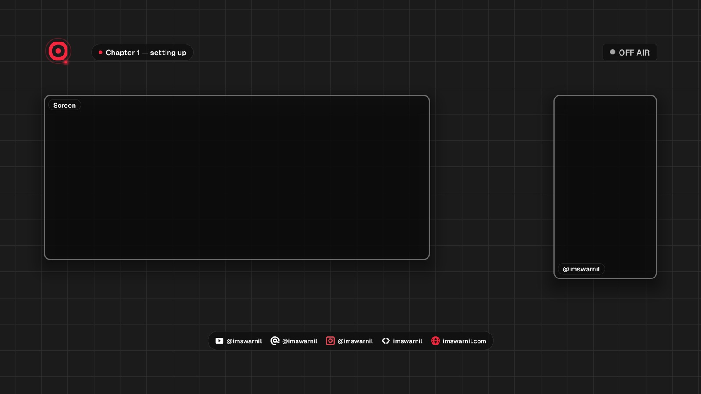
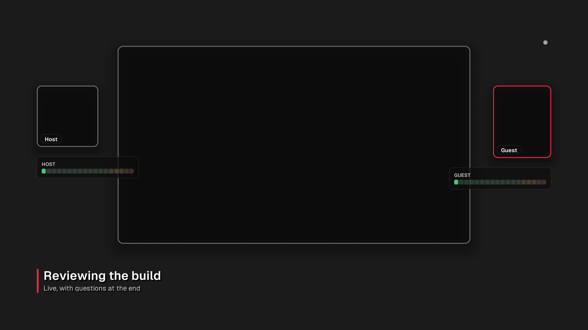
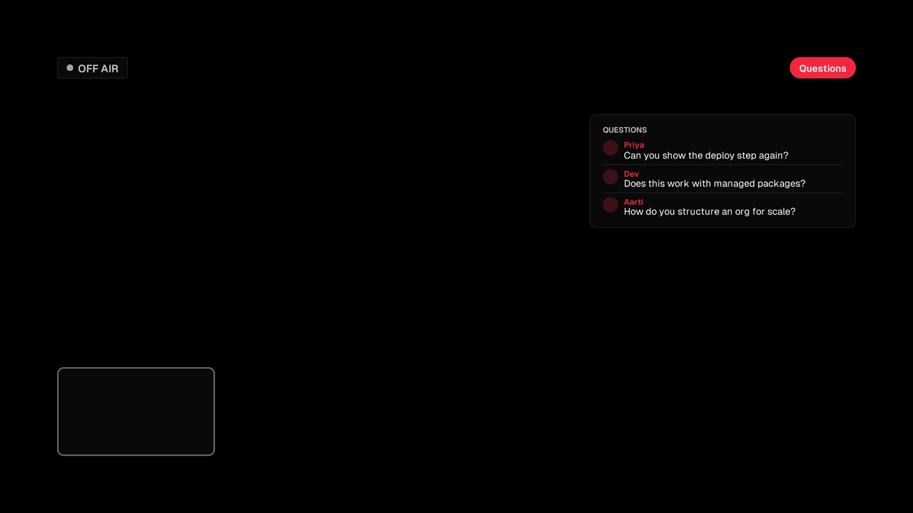
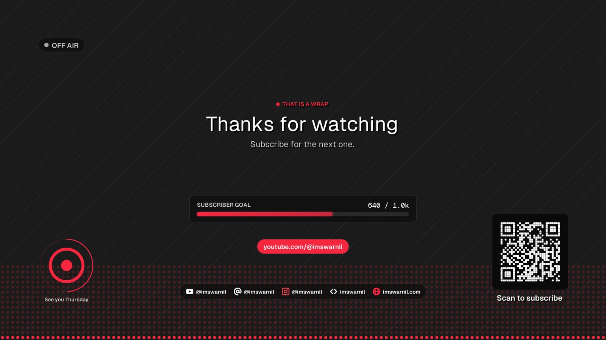
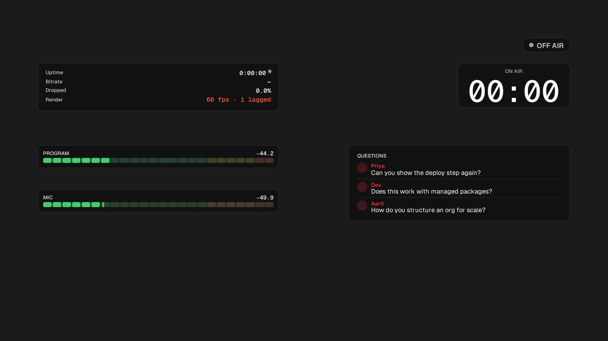
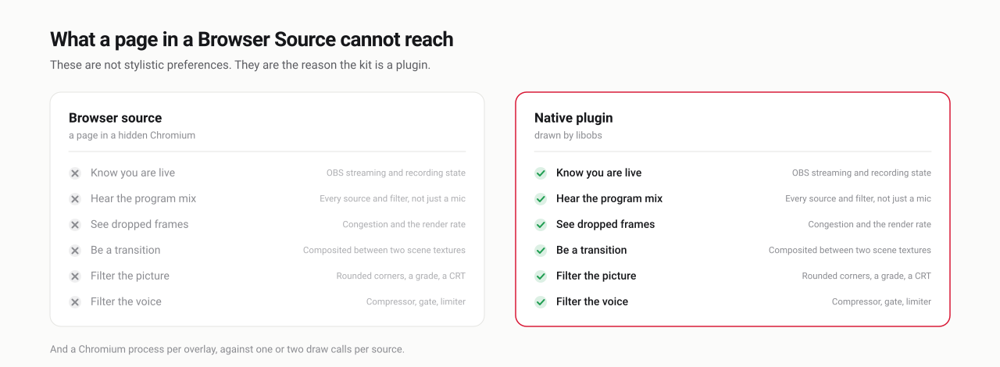
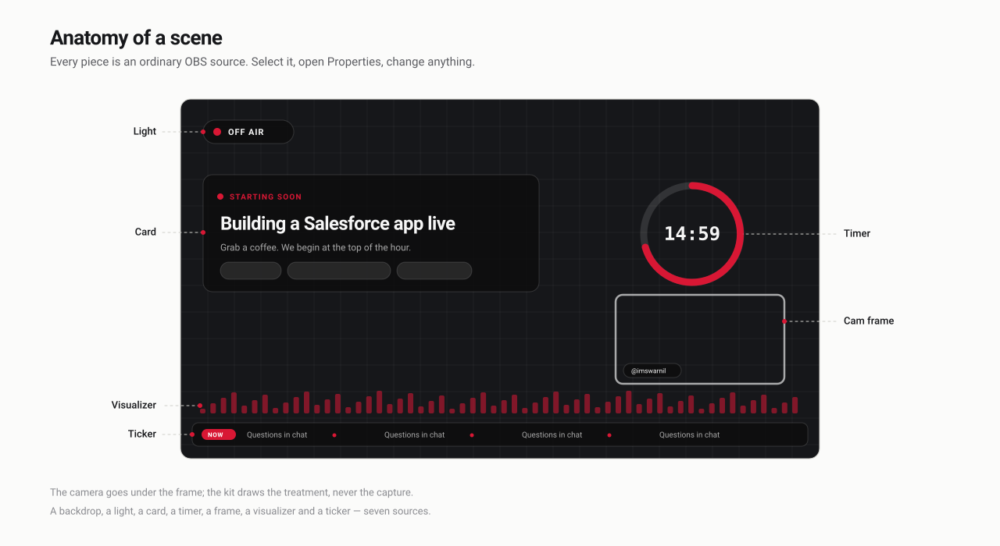

<picture>
  <source media="(prefers-color-scheme: dark)" srcset="docs/art/banner-dark.svg">
  
</picture>

# Swarnil Broadcast Kit

**Native OBS Studio overlays: twenty sources, six filters, two transitions, a
control dock and a show of twenty-two scenes — drawn by OBS itself.**

No browser source, no web server, no URL to paste. Drop `sbk.plugin` into OBS
and *Sources → +* fills up with **SBK …** sources drawn by libobs: type is OBS's
own FreeType text, every box is one small shader. The *Tools* menu builds a
whole show out of them.

→ **[obs.imswarnil.com](https://obs.imswarnil.com)** — documentation, a picture
of every scene, and a [builder](https://obs.imswarnil.com/builder/) that exports
a scene collection you can import straight into OBS.

→ **[Five ready-made shows](https://obs.imswarnil.com/make/)** — a course, a
podcast, a gaming set, a product demo and a vertical set. Download, import, pick
your camera. Each one is generated from a spec in [`presets/`](presets/) by the
same tool the agent skill uses.

---

## What it looks like

Real frames, straight off the plugin's own self-test — nothing here is a
mock-up, and the camera is hidden so these are the overlays alone.

| | |
| --- | --- |
|  |  |
| **Starting soon.** The screen people sit on. A countdown that restarts every time you cut to it. | **Two up.** A 21:9 screen and a 9:16 camera. Two aspect ratios, because matching them wastes half the picture. |
|  |  |
| **Three up.** A screen, a square host and a 4:5 guest, with a meter under each so a silent guest is obvious. | **Comments.** Questions on screen — typed, or read from your YouTube live chat. |
|  |  |
| **Ending.** The ask, with the goal it is asking for, and a QR that actually scans. | **Desk.** Not for the stream. Open it as a projector on a second monitor. |

**[Every one of the twenty-two →](https://obs.imswarnil.com/scenes/)**

---

## Why a plugin

<picture>
  <source media="(prefers-color-scheme: dark)" srcset="docs/art/native-dark.svg">
  
</picture>

These are not stylistic preferences. Each one is something a page inside a
Browser Source has no way to do — and a browser source also costs a whole
Chromium process per overlay, against one or two draw calls per source.

---

## Anatomy of a scene

<picture>
  <source media="(prefers-color-scheme: dark)" srcset="docs/art/anatomy-dark.svg">
  
</picture>

Every piece is an ordinary OBS source. Select it, open Properties, change
anything. The scenes the kit builds are a starting point, not a template you are
locked into.

---

## What ships

### Sources

| Source | What it does |
| --- | --- |
| **SBK Light** | The tally light. LIVE / REC / OFF AIR from OBS's own state. Five shapes: pill, badge, bare dot, a bar across the frame, or the whole canvas edge lit red. |
| **SBK Lower Third** | A name and a line under it. Card, pill, split, minimal or underline; replays its arrival on a hotkey. |
| **SBK Ticker** | A tag and items sliding across the foot. On glass, bare, or one chip per item, fading at both ends. |
| **SBK Cam Frame** | The treatment over your camera. 16:9, **9:16**, 1:1, 4:5, 4:3 or 21:9, and seven line treatments. |
| **SBK Logo** | A channel bug that is alive. Your PNG or a drawn mark, looping — breathe, pulse, spin, orbit, draw on, bob. No video file, no browser. |
| **SBK Plate** | The drop shadow OBS does not have. Put one behind a camera or a capture and it sits on the backdrop instead of floating on it. |
| **SBK Social** | Where to find you: a bar of handles, a stack, or **one at a time on a timer** — the only one people read. |
| **SBK Prompt** | The like-and-subscribe card, on a timer. Slides in, holds, slides out. Off screen in between, and quiet unless you are live if you want. |
| **SBK Visualizer** | Bars, mirrored bars, waveform, dot matrix, ring, block ladder or filled line — from the **program mix** by default. |
| **SBK Meter** | A real level meter in dB, with peak hold and the zones a broadcaster expects. |
| **SBK Stats** | Uptime, bitrate, dropped frames, render rate, and a health lamp. |
| **SBK Counter** | A live number from **YouTube**, **Ghost members**, or any JSON endpoint, with an optional goal bar. |
| **SBK QR** | A scannable code for a membership page, a donation link or your site. Generated in the plugin. |
| **SBK Card** | The announcement: eyebrow, title, body, chips. Five variants. |
| **SBK Backdrop** | Sixteen grounds: solid, scrim, vignette, gradient, grid, dots, stripes, waves, rings, hex, grain, aurora, plasma, starfield, checkers — and they drift. |
| **SBK Comments** | Questions on screen: typed by you, read from your **YouTube live chat**, or from any JSON. Pages through a queue on a timer. |
| **SBK Chip** | One badge: a handle, a count, a “Q&A”, with a dot that can light only when you are live. |
| **SBK Progress** | A goal, nudged up and down on a hotkey. |
| **SBK Timer** | Down to a duration or a time of day, or up from zero or since the stream started — digits, a ring, or a bar. |
| **SBK Clock** | The time, in the mono face. |

### Filters

| Filter | What it does |
| --- | --- |
| **SBK Round Corners** | Rounds your camera's corners — the picture itself, not a frame over it. |
| **SBK Colour** | A grade: exposure, white balance, contrast, vibrance, lift/gamma/gain. Seven presets, all corrections rather than looks. |
| **SBK Punch** | A zoom into the picture on a hotkey — it eases in, holds, and eases back. |
| **SBK Scanlines** | A CRT treatment: scanlines, aperture mask, fringing, curvature, grain. Four presets. |
| **SBK Voice** | *Audio.* High-pass, gate, compressor, presence, saturation, limiter, in the right order, with presets. |
| **SBK Radio** | *Audio.* Telephone, AM radio, megaphone, tannoy, walkie-talkie. |

### And

Two real transitions. **SBK Wipe** — bar, dip, slide, push, iris, blinds, or a
band of accent that takes the cut with it. **SBK Logo Sting** — a colour field
crosses, your logo lands on it, the field leaves on the next scene, and the cut
happens underneath where nobody sees it. No video file to render.

A **control dock** inside OBS. A **phone remote**. A **twenty-two-scene show** and a
1080p60 profile.

Every source shares a **Look** group — one accent colour, a scale slider that
grows type, padding and radius together, a tone (glass, solid or light) and the
font. Give every source the same accent and the scene changes together.

---

## Install

**macOS, Apple Silicon, OBS Studio 30 or newer.** The released bundle is arm64.
On an Intel Mac, build from source — `./build.command` produces a plugin for
whatever machine it runs on.

1. Quit OBS. Put `sbk.plugin` from a [release](https://github.com/imswarnil/Swarnil-Broadcast-Kit/releases) into
   `~/Library/Application Support/obs-studio/plugins/`.
2. Copy the files in `fonts/` into `~/Library/Fonts` — or pick any installed
   font in a source's *Look*.
3. Open OBS. **Tools → Broadcast Kit: create the scene collection** builds the
   show, switches to it, and puts your camera and microphone in — the camera
   with its corners genuinely rounded by a filter, not covered by one.
4. Add **SBK Wipe** or **SBK Logo Sting** from the Scene Transitions panel's **+**.

From source, `./build.command` does all of it. See [docs/INSTALL.md](docs/INSTALL.md).

## Control it

A **dock inside OBS** (Docks → Broadcast Kit): stream, record and mic, the
uptime and bitrate, a button per scene, a button for every hotkey the kit
registers, and the build actions.

A **phone remote** — `remote/serve.command` serves it on your own network and it
drives OBS through the WebSocket server OBS already has. It has to be served
over plain `http` from your own machine, and that is not a shortcut: a page
loaded over `https` cannot open the unencrypted `ws://` connection obs-websocket
speaks, so a hosted copy could never reach your OBS.

## Live numbers

`SBK Counter` polls on a worker thread — the picture never waits on the network,
and a failed request keeps the last good number rather than blinking to zero.

- **YouTube** — an API key and a channel id.
- **Ghost** — your site and an Admin API key; the kit signs a fresh
  five-minute token for every request.
- **Any JSON endpoint** — a URL and a dot-path such as `data.total`.

Keys typed into a source are saved in the scene collection as plain text.
Begin the field with `@` and a path — `@/Users/you/.youtube-key` — and the kit
reads the key from the file instead.

## Develop it

```
src/sbk-common.h      tokens, the card and ring helpers, the shared Look and surfaces
src/sbk-text.h        a line of type as a child text_ft2 source
src/sbk-stage.h       offscreen render target: fades, slides, clipping, edge fades
src/sbk-anim.h        the arrival
src/sbk-state.c       streaming / recording state and uptime, from the frontend
src/sbk-audio.c       program mix, channels or any source → FFT → bands and levels
src/sbk-dsp.h         biquads, compressor, limiter, gate — the audio filters' maths
src/sbk-net.c         the polled HTTPS GET, and the JSON dot-path walk
src/sbk-qr.c          a QR encoder: byte mode, versions 1–16, all four ECC levels
src/source-*.c        one file per source
src/filter-*.c        round, scanlines, colour, punch, voice, radio
src/transition-wipe.c the transition
src/dock.cpp          the control panel; Qt headers from Homebrew, frameworks from OBS
src/scenes.c          the show, the live pack, the profile switch, the self-test
data/effects/         card, frame, ring, viz, backdrop, qr, wipe, blit, round, scanlines, colour, punch
site/                 the documentation site and the builder (plain Node, no dependencies)
remote/               the phone remote: one page, one hand-rolled SHA-256, no build
docs/art/             the illustrations above, generated by docs/art/build.mjs
docs/screens/         real frames from the self-test, used by the site
deps/include/         libobs headers for OBS 32.2.2 (GPL-2.0; see deps/README.md)
```

```bash
brew install cmake simde jansson qt
./build.command          # build, install the plugin, fonts and profile (quit OBS first)
node site/build.mjs      # the docs site → dist/
node site/check.mjs      # what CI runs on it
node docs/art/build.mjs  # regenerate the illustrations
```

Nothing is downloaded at build time. CI builds the plugin on a clean Mac with
OBS from Homebrew, checks that every source is registered, builds the site and
deploys it; a `v*` tag attaches the bundle to a release.

## Build scenes with an agent

The kit ships an **agent skill**. Install it and Claude Code (or anything that
reads the Agent Skills format) can design a scene, or a whole show, out of these
sources and hand back a collection OBS will import.

```bash
git clone https://github.com/imswarnil/Swarnil-Broadcast-Kit.git
mkdir -p ~/.claude/skills
cp -R Swarnil-Broadcast-Kit/skills/sbk-scenes ~/.claude/skills/
```

Then ask for what you want:

> *Build me a screen-share scene with the camera bottom-right on a plate, a
> chapter chip, a mic meter, and a questions panel down the right.*

It knows every source and every setting because its reference is **generated
from the plugin's own C** — a key it has not been told about is a key no source
reads. It validates a spec before writing anything and reports the near misses
for a setting you mistyped, which matters because OBS silently ignores a setting
it does not recognise: a typo gives you a scene that looks almost right and
nobody can say why.

You can drive the generator yourself, without an agent:

```bash
node skills/sbk-scenes/scripts/build-collection.mjs my-show.json --check
node skills/sbk-scenes/scripts/build-collection.mjs my-show.json -o my-show.collection.json
```

Then **OBS → Scene Collection → Import**. It adds one beside the collection you
are on rather than replacing it.

Full documentation: **[docs/SKILL.md](docs/SKILL.md)**. Six worked scenes:
[`skills/sbk-scenes/references/recipes.md`](skills/sbk-scenes/references/recipes.md).

## Use it, change it, sell what you make with it

MIT. Use it on a monetised channel, fork it, rename it, ship it inside something
you charge for. No attribution is required, though a link is always welcome.

The one thing to know is in the licence section at the foot of this page: a
*compiled* plugin links libobs, which is GPL-2.0, so a binary you distribute
carries the GPL's terms with it. The source in this repository is MIT and stays
MIT.

## Contribute

Issues and pull requests are both welcome, and a good bug report is worth as
much as a patch. **[CONTRIBUTING.md](CONTRIBUTING.md)** has the whole of it; the
short version:

[`ROADMAP.md`](ROADMAP.md) says what is next and what is deliberately not.
`make` lists every job in the repository; `make check` is exactly what CI runs.

- **Something is wrong** — open an issue with the OBS version, your platform, and
  the newest log from `~/Library/Application Support/obs-studio/logs/`. The log
  usually contains the answer.
- **You want a source** — say what you would put on screen and why the existing
  ones cannot. A source that only differs in its defaults is a preset, not a
  source.
- **You are sending code** — one source per file, the shared helpers, every
  length as a multiple of `u`. Run `./build.command`, add the thing in OBS, move
  every slider, then run the self-test and look at the pictures.

Two rules are not negotiable, because they are what keeps the kit
redistributable: **no code from any commercial theme or design system**, and
**no trademarked logos** — the marks in `glyph.effect` are generic on purpose,
and a platform is identified by its colour and its name in type.

## Design

The kit speaks the visual language of the
[Im Design System](https://design.imswarnil.com) — a neutral palette, Geist, one
accent, pills, the recording-light dot — and **shares no code with it**. That
system is all-rights-reserved and sold; this is MIT and public, so the two are
kept independent in both directions.

## Licence

The kit's code is [MIT](LICENSE). A compiled plugin links **libobs** (GPL-2.0),
whose headers are vendored in `deps/`, so the binary is distributed under the
GPL's terms. Geist and Geist Mono are © Vercel under the SIL Open Font License
1.1. [`NOTICE`](NOTICE) has all of it in one place.
